# Diagramas del Framework AI-Driven Engineering - Tech&Solve

---

## 1. Visión General: Las 5 Fases del Framework

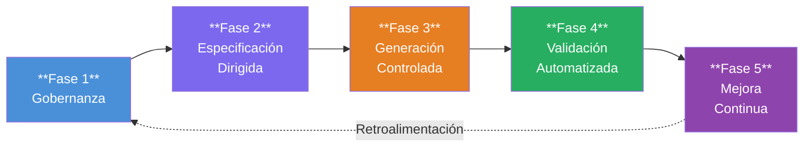

---

## 2. Entradas y Salidas de Cada Fase

```mermaid
flowchart TB
    subgraph FASE1["FASE 1: Gobernanza"]
        direction TB
        I1["**Entradas:**<br>- Necesidades del negocio<br>- Restricciones regulatorias<br>- Lecciones aprendidas"]
        O1["**Salidas:**<br>- Principios de arquitectura<br>- ADRs aprobados<br>- Estándares de código y seguridad<br>- Clasificación de datos (DLP)"]
        I1 ~~~ O1
    end

    subgraph FASE2["FASE 2: Especificación Dirigida"]
        direction TB
        I2["**Entradas:**<br>- Principios y ADRs (Fase 1)<br>- Historias de usuario<br>- Requerimientos de negocio"]
        O2["**Salidas:**<br>- Spec L1 (dominio + clasificación datos)<br>- Spec L2 (sistema + contratos API)<br>- Spec L3 (cambio incremental)<br>- Todas versionadas con semver"]
        I2 ~~~ O2
    end

    subgraph FASE3["FASE 3: Generación Controlada"]
        direction TB
        I3["**Entradas:**<br>- Spec aprobada y versionada<br>- ADRs relevantes<br>- Contexto mínimo necesario<br>- Skill aplicable"]
        O3["**Salidas:**<br>- Código en la capa correcta<br>- Tests basados en spec<br>- Diff pequeño y revisable<br>- Masking de PII aplicado"]
        I3 ~~~ O3
    end

    subgraph FASE4["FASE 4: Validación Automatizada"]
        direction TB
        I4["**Entradas:**<br>- Código generado (Fase 3)<br>- Tests GWT definidos<br>- Pipeline CI/CD configurado"]
        O4["**Salidas:**<br>- Resultados de tests unitarios<br>- Reporte SAST/SCA<br>- Reporte DLP Scan<br>- PR validado para revisión"]
        I4 ~~~ O4
    end

    subgraph FASE5["FASE 5: Mejora Continua"]
        direction TB
        I5["**Entradas:**<br>- Métricas de calidad IA<br>- Métricas DORA<br>- Métricas DLP<br>- Métricas de skills<br>- Hallazgos post-deploy"]
        O5["**Salidas:**<br>- Specs refinadas<br>- Skills evolucionados<br>- ADRs actualizados<br>- Quality gates ajustados"]
        I5 ~~~ O5
    end

    FASE1 --> FASE2 --> FASE3 --> FASE4 --> FASE5
    FASE5 -.->|Retroalimenta| FASE1

    style FASE1 fill:#e8f4fd,stroke:#4a90d9
    style FASE2 fill:#ede7f6,stroke:#7b68ee
    style FASE3 fill:#fff3e0,stroke:#e67e22
    style FASE4 fill:#e8f5e9,stroke:#27ae60
    style FASE5 fill:#f3e5f5,stroke:#8e44ad
```

---

## 3. Roles y Responsabilidades por Fase

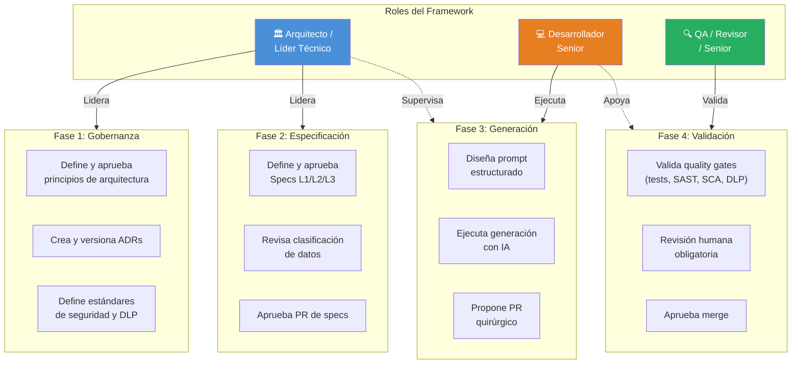

---

## 4. Niveles de Especificación y su Relación

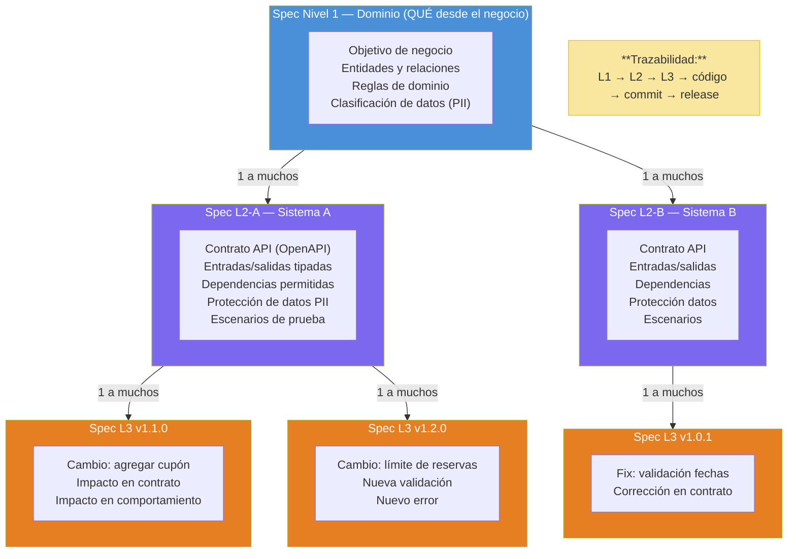

---

## 5. Quality Gates — Flujo de Control

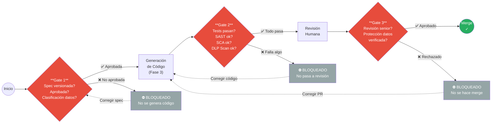

---

## 6. Cadena de Trazabilidad Completa

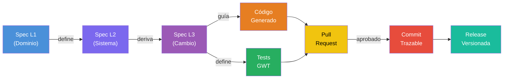

---

## 7. Catálogo de Skills y su Ubicación en Fases

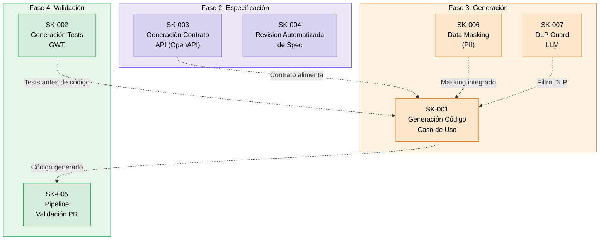

---

## 8. Niveles de Madurez de Adopción

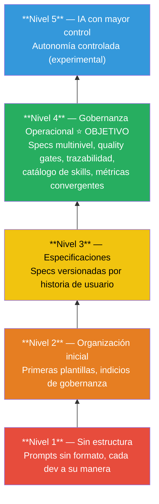

---

## 9. Flujo DLP (Protección de Datos) End-to-End

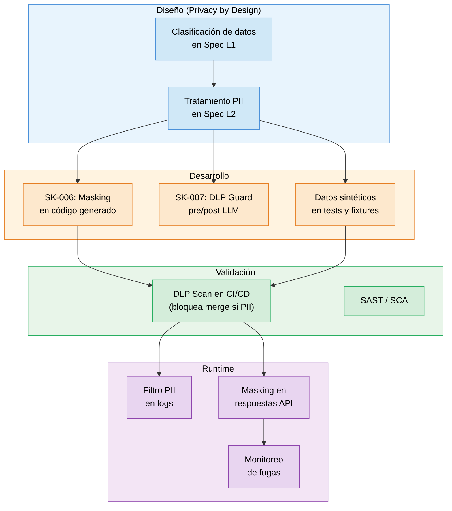

---

## 10. Modelo de Costos — Modelo por Tipo de Tarea

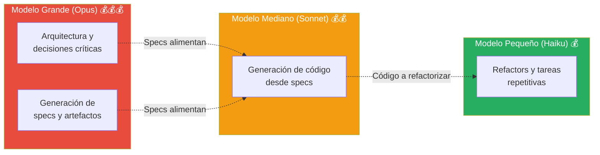

---

## 11. Plan de Adopción 30-60-90 Días

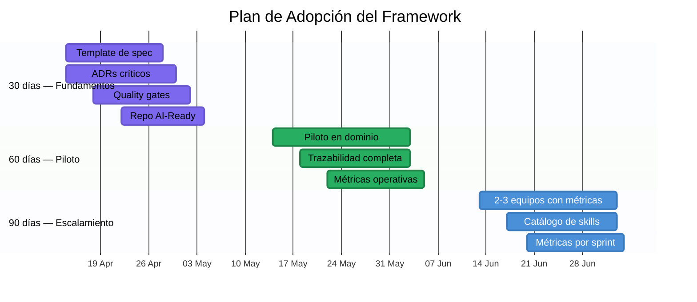

---

## 12. Ejemplo Completo: Sistema de Booking

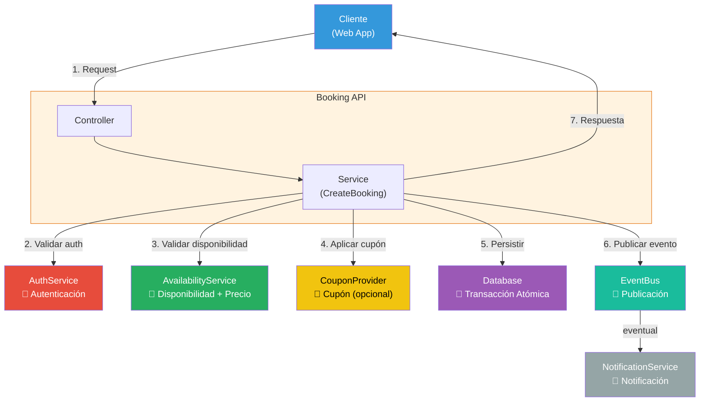

---

## 13. Anti-patrones vs. Patrones Correctos

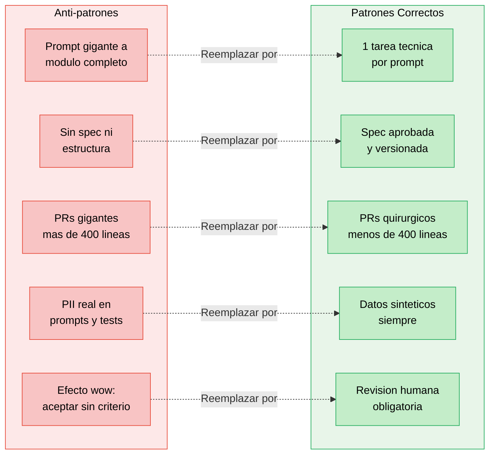

---

## 14. Alineacion DDD en Especificaciones

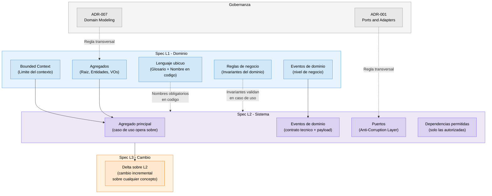

---

## Cómo Visualizar Estos Diagramas

Estos diagramas están en formato **Mermaid** y se pueden renderizar en:

1. **GitHub / GitLab** — renderiza Mermaid automáticamente en archivos `.md`
2. **VS Code** — extensión "Markdown Preview Mermaid Support"
3. **Mermaid Live Editor** — [mermaid.live](https://mermaid.live)
4. **Notion** — soporta bloques Mermaid nativamente
5. **Confluence** — con plugin de Mermaid
