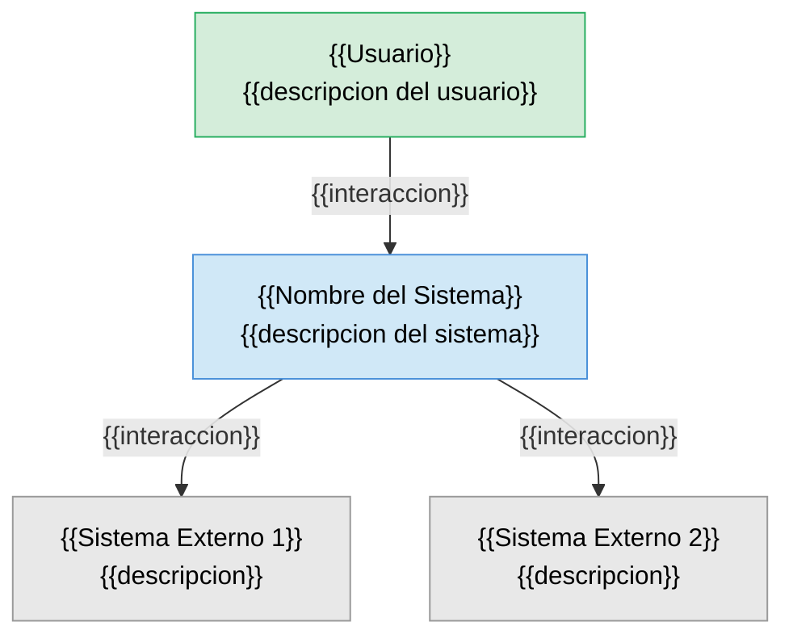

# C1 — Diagrama de Contexto

```mermaid
flowchart TB
    USER["{{Usuario}}<br>{{descripcion del usuario}}"]
    SYSTEM["{{Nombre del Sistema}}<br>{{descripcion del sistema}}"]
    EXT1["{{Sistema Externo 1}}<br>{{descripcion}}"]
    EXT2["{{Sistema Externo 2}}<br>{{descripcion}}"]

    USER -->|"{{interaccion}}"| SYSTEM
    SYSTEM -->|"{{interaccion}}"| EXT1
    SYSTEM -->|"{{interaccion}}"| EXT2

    style SYSTEM fill:#d0e8f7,stroke:#4a90d9,color:#000
    style USER fill:#d4edda,stroke:#27ae60,color:#000
    style EXT1 fill:#e8e8e8,stroke:#999,color:#000
    style EXT2 fill:#e8e8e8,stroke:#999,color:#000
```

> Reemplazar los placeholders {{...}} con los valores reales del proyecto.
