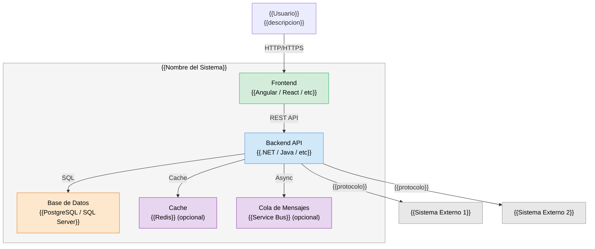

# C2 — Diagrama de Contenedores

```mermaid
flowchart TB
    USER["{{Usuario}}<br>{{descripcion}}"]

    subgraph SYSTEM["{{Nombre del Sistema}}"]
        FE["Frontend<br>{{Angular / React / etc}}"]
        BE["Backend API<br>{{.NET / Java / etc}}"]
        DB["Base de Datos<br>{{PostgreSQL / SQL Server}}"]
        CACHE["Cache<br>{{Redis}} (opcional)"]
        QUEUE["Cola de Mensajes<br>{{Service Bus}} (opcional)"]
    end

    EXT1["{{Sistema Externo 1}}"]
    EXT2["{{Sistema Externo 2}}"]

    USER -->|"HTTP/HTTPS"| FE
    FE -->|"REST API"| BE
    BE -->|"SQL"| DB
    BE -->|"Cache"| CACHE
    BE -->|"Async"| QUEUE
    BE -->|"{{protocolo}}"| EXT1
    BE -->|"{{protocolo}}"| EXT2

    style SYSTEM fill:#f5f5f5,stroke:#999,color:#000
    style FE fill:#d4edda,stroke:#27ae60,color:#000
    style BE fill:#d0e8f7,stroke:#4a90d9,color:#000
    style DB fill:#fde8cd,stroke:#e67e22,color:#000
    style CACHE fill:#e8d5f0,stroke:#8e44ad,color:#000
    style QUEUE fill:#e8d5f0,stroke:#8e44ad,color:#000
    style EXT1 fill:#e8e8e8,stroke:#999,color:#000
    style EXT2 fill:#e8e8e8,stroke:#999,color:#000
```

> Reemplazar los placeholders {{...}} con los valores reales del proyecto. Eliminar componentes opcionales si no aplican.
